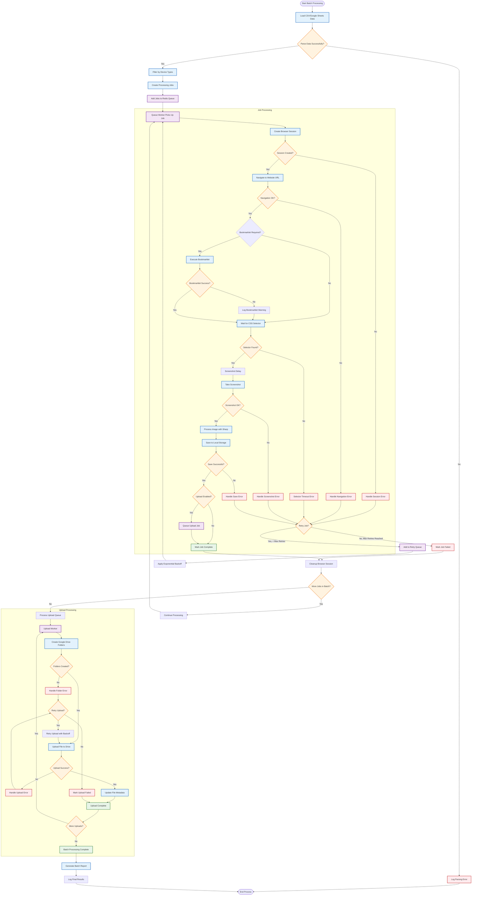

# Automation Process Flowchart

## Process Flow Details

### Phase 1: Data Ingestion and Job Creation
1. **Load Data**: Parse CSV files or fetch Google Sheets data
2. **Filter Records**: Apply device type filters if specified
3. **Create Jobs**: Convert records into processing jobs with unique IDs
4. **Queue Management**: Add jobs to Redis queues with priority levels

### Phase 2: Screenshot Processing
1. **Browser Session**: Create isolated Chrome browser session with device emulation
2. **Navigation**: Navigate to target URL with timeout protection
3. **Bookmarklet Execution**: Inject and execute JavaScript if required
4. **Element Detection**: Wait for CSS selector with configurable timeout
5. **Screenshot Capture**: Take high-quality screenshot with Sharp processing
6. **Local Storage**: Save with organized naming convention

### Phase 3: Upload Processing
1. **Google Drive Integration**: Create organized folder structure
2. **File Upload**: Transfer screenshots to cloud storage
3. **Metadata Management**: Set file descriptions and organize by date/platform

### Phase 4: Error Handling and Retry Logic
1. **Error Categorization**: Classify errors by type (network, timeout, selector, etc.)
2. **Retry Strategy**: Apply appropriate backoff algorithms
3. **Circuit Breaker**: Prevent cascade failures
4. **Cleanup**: Ensure resources are properly released

### Performance Characteristics
- **Concurrency**: 3-5 parallel browser sessions (configurable)
- **Batch Size**: 50+ records per batch with memory optimization
- **Retry Logic**: Up to 3 attempts with exponential backoff
- **Timeout Protection**: Multiple timeout layers for reliability