# Data Flow Diagram

```mermaid
flowchart LR
    subgraph "Input Sources"
        CSV1[CSV Files<br/>📄 sample-ads.csv]
        CSV2[CSV Files<br/>📄 batch-001.csv]
        GSheets[Google Sheets<br/>🔗 Online Spreadsheets]
    end
    
    subgraph "Data Ingestion Layer"
        DIS[DataIngestionService<br/>🔄 Parser & Validator]
        
        subgraph "Data Transformation"
            Parse[Parse CSV/Sheets]
            Validate[Validate Records]
            Transform[Transform to AdRecord]
        end
        
        Parse --> Validate
        Validate --> Transform
    end
    
    subgraph "Queue Management"
        QM[QueueManager<br/>📊 Redis Bull Queues]
        
        subgraph "Queue Types"
            ScreenshotQ[(Screenshot Queue<br/>Priority: NORMAL)]
            RetryQ[(Retry Queue<br/>Priority: HIGH)]  
            UploadQ[(Upload Queue<br/>Priority: LOW)]
        end
        
        QM --> ScreenshotQ
        QM --> RetryQ
        QM --> UploadQ
    end
    
    subgraph "Processing Pipeline"
        PP[ProcessingPipeline<br/>🎯 Orchestrator]
        
        subgraph "Job Data Structure"
            JobID[Job ID: batch_timestamp_random]
            JobRecord[AdRecord: URL, PID, UID, AdType, Selector, DeviceUI]
            JobMetadata[Metadata: BatchID, RetryCount, Priority, Timestamps]
        end
        
        JobID -.-> JobRecord
        JobRecord -.-> JobMetadata
    end
    
    subgraph "Browser Processing"
        BAE[BrowserAutomationEngine<br/>🌐 Chrome Control]
        
        subgraph "Browser Sessions"
            Session1[Session 1: Android]
            Session2[Session 2: iOS]
            Session3[Session 3: Desktop]
        end
        
        BAE --> Session1
        BAE --> Session2
        BAE --> Session3
    end
    
    subgraph "Screenshot Generation"
        SM[ScreenshotManager<br/>📷 Image Processing]
        
        subgraph "Screenshot Pipeline"
            Capture[Capture Screenshot Buffer]
            Process[Process with Sharp]
            Optimize[Optimize Image Quality]
        end
        
        Capture --> Process
        Process --> Optimize
    end
    
    subgraph "File Management"
        FSS[FileStorageService<br/>📁 Local Storage]
        
        subgraph "Naming Convention"
            DatePrefix[Date: 2024-01-15]
            Platform[Platform: Android/iOS/Desktop]
            Identifiers[PID_UID_AdType]
            DeviceUI[DeviceUI Suffix]
            Extension[File Extension: .png]
        end
        
        subgraph "Folder Structure"
            BaseDir[/screenshots/]
            DateFolder[/2024/01/15/]
            PlatformFolder[/Android/]
            FinalPath[Final: /screenshots/2024/01/15/Android/2024-01-15_Android_P123_U456_Banner_Mobile.png]
        end
        
        DatePrefix --> DateFolder
        Platform --> PlatformFolder
        DateFolder --> PlatformFolder
        PlatformFolder --> FinalPath
    end
    
    subgraph "Cloud Upload"
        US[UploadService<br/>☁️ Google Drive]
        
        subgraph "Drive Organization"
            RootFolder[Ad Screenshots Root]
            YearFolder[2024/]
            MonthFolder[01 - January/]
            DayFolder[15/]
            PlatformDriveFolder[Android/]
        end
        
        RootFolder --> YearFolder
        YearFolder --> MonthFolder
        MonthFolder --> DayFolder
        DayFolder --> PlatformDriveFolder
    end
    
    subgraph "Data Outputs"
        LocalFiles[Local Screenshots<br/>📁 Organized by Date/Platform]
        DriveFiles[Google Drive Files<br/>☁️ Cloud Storage with Metadata]
        Logs[Log Files<br/>📋 Processing History]
        Reports[Batch Reports<br/>📊 Success/Failure Statistics]
    end
    
    %% Main Data Flow
    CSV1 --> DIS
    CSV2 --> DIS
    GSheets --> DIS
    
    DIS --> Parse
    Transform --> PP
    PP --> QM
    
    ScreenshotQ --> BAE
    RetryQ --> BAE
    BAE --> SM
    
    SM --> Capture
    Optimize --> FSS
    FSS --> FinalPath
    FinalPath --> LocalFiles
    
    UploadQ --> US
    FSS --> US
    US --> PlatformDriveFolder
    PlatformDriveFolder --> DriveFiles
    
    %% Logging and Reporting
    PP --> Logs
    PP --> Reports
    
    %% Data Format Annotations
    CSV1 -.->|"CSV Format:<br/>WebsiteURL,PID,UID,AdType,Selector,DeviceUI"| DIS
    GSheets -.->|"Same CSV Format<br/>from Google Sheets API"| DIS
    
    Transform -.->|"AdRecord Interface:<br/>{WebsiteURL, PID, UID, AdType, Selector, DeviceUI}"| PP
    
    JobMetadata -.->|"ProcessingJob:<br/>{id, record, batchId, retryCount, priority, createdAt, updatedAt}"| QM
    
    Optimize -.->|"Screenshot Buffer<br/>PNG format, optimized"| FSS
    
    FinalPath -.->|"File Name Pattern:<br/>YYYY-MM-DD_Platform_PID_UID_AdType_DeviceUI.png"| LocalFiles
    
    PlatformDriveFolder -.->|"Google Drive File<br/>with description metadata"| DriveFiles
    
    %% Styling
    classDef input fill:#e8f5e8,stroke:#2e7d32,stroke-width:2px
    classDef processing fill:#e3f2fd,stroke:#1565c0,stroke-width:2px
    classDef storage fill:#fff3e0,stroke:#f57c00,stroke-width:2px
    classDef queue fill:#f3e5f5,stroke:#6a1b9a,stroke-width:2px
    classDef output fill:#fce4ec,stroke:#880e4f,stroke-width:2px
    classDef data fill:#f1f8e9,stroke:#558b2f,stroke-width:1px,stroke-dasharray: 5 5
    
    class CSV1,CSV2,GSheets input
    class DIS,PP,BAE,SM processing
    class FSS,US,QM storage
    class ScreenshotQ,RetryQ,UploadQ queue
    class LocalFiles,DriveFiles,Logs,Reports output
    class Parse,Validate,Transform,JobID,JobRecord,JobMetadata,Capture,Process,Optimize,DatePrefix,Platform,Identifiers,DeviceUI,Extension,BaseDir,DateFolder,PlatformFolder,FinalPath,RootFolder,YearFolder,MonthFolder,DayFolder,PlatformDriveFolder,Session1,Session2,Session3 data
```



## Data Transformation Pipeline

### Input Data Format
```csv
WebsiteURL,PID,UID,AdType,Selector,DeviceUI
https://example.com/page,P123,U456,Banner,.ad-banner,Android
https://test.com/ads,P789,U012,Video,#video-player,iOS
https://demo.site/shop,P345,U678,Overlay,.modal-overlay,Desktop
```

### AdRecord Interface
```typescript
interface AdRecord {
  WebsiteURL: string;    // Target website URL
  PID: string;           // Publisher ID
  UID: string;           // User ID  
  AdType: string;        // Advertisement type
  Selector: string;      // CSS selector for element
  DeviceUI: DeviceType;  // Device emulation type
}
```

### Processing Job Structure
```typescript
interface ProcessingJob {
  id: string;            // Unique job identifier
  record: AdRecord;      // Original ad record data
  batchId: string;       // Batch processing identifier
  retryCount: number;    // Current retry attempt
  priority: JobPriority; // Queue priority level
  createdAt: Date;       // Job creation timestamp
  updatedAt: Date;       // Last modification timestamp
}
```

### File Naming Convention
```
Pattern: {Date}_{PlatformName}_{PID}_{UID}_{AdType}_{DeviceUI}.png
Example: 2024-01-15_Android_P123_U456_Banner_Mobile.png
```

### Folder Structure
```
Local Storage:
/screenshots/
├── 2024/
│   ├── 01/
│   │   ├── 15/
│   │   │   ├── Android/
│   │   │   │   └── 2024-01-15_Android_P123_U456_Banner_Mobile.png
│   │   │   ├── iOS/
│   │   │   │   └── 2024-01-15_iOS_P789_U012_Video_Mobile.png
│   │   │   └── Desktop/
│   │   │       └── 2024-01-15_Desktop_P345_U678_Overlay_Desktop.png

Google Drive:
Ad Screenshots/
├── 2024/
│   ├── 01 - January/
│   │   ├── 15/
│   │   │   ├── Android/
│   │   │   ├── iOS/
│   │   │   └── Desktop/
```

### Queue Data Flow

#### Screenshot Queue
- **Priority**: NORMAL (5)
- **Concurrency**: 3 workers
- **Data**: ProcessingJob with AdRecord
- **Processing**: Browser automation → Screenshot capture

#### Retry Queue  
- **Priority**: HIGH (10)
- **Concurrency**: 1 worker
- **Data**: Failed jobs with incremented retry count
- **Processing**: Exponential backoff → Retry processing

#### Upload Queue
- **Priority**: LOW (1)
- **Concurrency**: 2 workers
- **Data**: File path + metadata
- **Processing**: Google Drive folder creation → File upload

### Data Quality and Validation

#### Input Validation
1. **URL Validation**: Check for valid HTTP/HTTPS URLs
2. **Selector Validation**: Verify CSS selector syntax
3. **Device Type**: Validate against supported device profiles
4. **Required Fields**: Ensure all mandatory fields present

#### Processing Validation
1. **Screenshot Quality**: Verify image dimensions and file size
2. **File Integrity**: Check for corrupted image data
3. **Upload Verification**: Confirm successful Google Drive upload
4. **Metadata Accuracy**: Validate file naming and organization

### Performance Metrics

#### Throughput
- **Target**: 50+ records per batch
- **Concurrency**: 3-5 parallel browser sessions
- **Average Processing Time**: 10-15 seconds per screenshot

#### Storage Efficiency  
- **Image Optimization**: Sharp compression (85% quality)
- **Average File Size**: 200-500KB per screenshot
- **Local Storage**: Organized by date for easy cleanup
- **Cloud Storage**: Automated folder structure with metadata

#### Error Handling
- **Retry Logic**: 3 attempts with exponential backoff
- **Data Persistence**: Queue jobs persist through Redis
- **Partial Failures**: Individual job failures don't affect batch
- **Recovery**: Automatic browser session recovery