# Deployment Architecture

```mermaid
graph TB
    subgraph "Production Environment"
        subgraph "Application Server"
            App[Ad Screenshot System<br/>🚀 Node.js Application]
            PM2[PM2 Process Manager<br/>⚡ Auto-restart & Clustering]
            
            subgraph "Core Services"
                Pipeline[Processing Pipeline]
                Browser[Browser Engine]
                Queue[Queue Manager]
                Upload[Upload Service]
            end
            
            App --> Pipeline
            Pipeline --> Browser
            Pipeline --> Queue
            Pipeline --> Upload
            PM2 --> App
        end
        
        subgraph "Data Storage"
            Redis[(Redis Server<br/>📊 Queue & Cache)]
            LocalFS[Local File System<br/>📁 Screenshot Storage]
            LogFiles[Log Files<br/>📋 /var/log/ad-screenshot/]
        end
        
        subgraph "External Services"
            Chrome[Chrome Browser<br/>🌐 Headless Mode]
            ChromeExt[Chrome Extension<br/>🔌 Screenshot Helper]
            GDrive[Google Drive API<br/>☁️ Cloud Storage]
        end
        
        subgraph "Monitoring Stack"
            HealthCheck[Health Check Service<br/>❤️ Port 3001]
            Metrics[Metrics Collector<br/>📊 System Stats]
            AlertSystem[Alerting System<br/>🚨 Multi-channel Notifications]
        end
        
        subgraph "Automation"
            CronScheduler[Cron Scheduler<br/>⏰ Automated Tasks]
            
            subgraph "Cron Jobs"
                MainCron[*/30 * * * * - Main Processing<br/>run-automation.sh]
                HealthCron[*/5 * * * * - Health Checks<br/>health-check.sh]
                CleanupCron[0 2 * * * - Log Cleanup<br/>cleanup.sh]
                BackupCron[0 3 * * 0 - Weekly Backup<br/>backup.sh]
                RotateCron[0 1 * * * - Log Rotation<br/>rotate-logs.sh]
            end
        end
    end
    
    subgraph "Development Environment"
        DevApp[Development Server<br/>🔧 localhost:3000]
        DevRedis[(Development Redis<br/>🏠 Local Instance)]
        DevChrome[Development Chrome<br/>🔍 Debug Mode]
    end
    
    subgraph "CI/CD Pipeline"
        GitHub[GitHub Repository<br/>📂 Source Code]
        Actions[GitHub Actions<br/>🔄 CI/CD Workflows]
        
        subgraph "Workflows"
            TestFlow[Test Workflow<br/>✅ Unit & Integration Tests]
            BuildFlow[Build Workflow<br/>🏗️ TypeScript Compilation]
            DeployFlow[Deploy Workflow<br/>🚀 Production Deployment]
        end
        
        GitHub --> Actions
        Actions --> TestFlow
        Actions --> BuildFlow
        Actions --> DeployFlow
    end
    
    subgraph "Configuration Management"
        EnvFiles[Environment Files<br/>⚙️ .env configurations]
        ConfigFiles[Config Files<br/>📋 JSON/YAML settings]
        Secrets[Secrets Management<br/>🔐 API Keys & Credentials]
    end
    
    %% Connections
    Pipeline --> Redis
    Pipeline --> LocalFS
    Browser --> Chrome
    Browser --> ChromeExt
    Upload --> GDrive
    
    App --> HealthCheck
    App --> Metrics
    Metrics --> AlertSystem
    
    CronScheduler --> MainCron
    CronScheduler --> HealthCron
    CronScheduler --> CleanupCron
    CronScheduler --> BackupCron
    CronScheduler --> RotateCron
    
    MainCron --> App
    HealthCron --> HealthCheck
    CleanupCron --> LogFiles
    BackupCron --> LocalFS
    RotateCron --> LogFiles
    
    EnvFiles --> App
    ConfigFiles --> App
    Secrets --> App
    Secrets --> GDrive
    
    DeployFlow --> App
    TestFlow --> DevApp
    DevApp --> DevRedis
    DevApp --> DevChrome
    
    %% Data Flow Annotations
    Redis -.->|"Queue Jobs<br/>Bull Redis Queues"| Queue
    LocalFS -.->|"Screenshots<br/>Organized by Date"| Upload
    Chrome -.->|"Page Screenshots<br/>Mobile Emulation"| Browser
    GDrive -.->|"Cloud Storage<br/>Automated Folders"| Upload
    
    HealthCheck -.->|"HTTP Endpoints<br/>System Status"| AlertSystem
    AlertSystem -.->|"Email/Slack/Discord<br/>Multi-channel Alerts"| External[External Notifications]
    
    MainCron -.->|"Batch Processing<br/>CSV/Google Sheets"| App
    
    %% Styling
    classDef application fill:#e3f2fd,stroke:#1565c0,stroke-width:2px
    classDef storage fill:#fff3e0,stroke:#f57c00,stroke-width:2px
    classDef external fill:#f3e5f5,stroke:#6a1b9a,stroke-width:2px
    classDef monitoring fill:#e8f5e8,stroke:#2e7d32,stroke-width:2px
    classDef automation fill:#fce4ec,stroke:#880e4f,stroke-width:2px
    classDef development fill:#f1f8e9,stroke:#558b2f,stroke-width:2px
    classDef cicd fill:#e0f2f1,stroke:#00695c,stroke-width:2px
    classDef config fill:#fff8e1,stroke:#ff8f00,stroke-width:2px
    
    class App,PM2,Pipeline,Browser,Queue,Upload application
    class Redis,LocalFS,LogFiles storage
    class Chrome,ChromeExt,GDrive,External external
    class HealthCheck,Metrics,AlertSystem monitoring
    class CronScheduler,MainCron,HealthCron,CleanupCron,BackupCron,RotateCron automation
    class DevApp,DevRedis,DevChrome development
    class GitHub,Actions,TestFlow,BuildFlow,DeployFlow cicd
    class EnvFiles,ConfigFiles,Secrets config
```



## Deployment Configuration

### Application Server Setup

#### Node.js Environment
```bash
# Production Configuration
NODE_ENV=production
PORT=3000

# Application scaling with PM2
pm2 start src/index.js --name "ad-screenshot" --instances 2
pm2 startup
pm2 save
```

#### Service Dependencies
```yaml
# docker-compose.yml
version: '3.8'
services:
  redis:
    image: redis:7-alpine
    ports:
      - "6379:6379"
    volumes:
      - redis-data:/data
    restart: unless-stopped
  
  chrome:
    image: zenika/alpine-chrome:latest
    shm_size: 2gb
    ports:
      - "9222:9222"
    command: --remote-debugging-address=0.0.0.0 --remote-debugging-port=9222
```

### Cron Job Configuration

#### Automated Processing Schedule
```bash
# /etc/crontab entries
# Run main processing every 30 minutes
*/30 * * * * /opt/ad-screenshot/scripts/cron/run-automation.sh

# Health checks every 5 minutes
*/5 * * * * /opt/ad-screenshot/scripts/cron/health-check.sh

# Daily log cleanup at 2 AM
0 2 * * * /opt/ad-screenshot/scripts/cron/cleanup.sh

# Weekly backup on Sundays at 3 AM
0 3 * * 0 /opt/ad-screenshot/scripts/cron/backup.sh

# Daily log rotation at 1 AM
0 1 * * * /opt/ad-screenshot/scripts/cron/rotate-logs.sh
```

#### Cron Script Examples
```bash
#!/bin/bash
# run-automation.sh
cd /opt/ad-screenshot
export NODE_ENV=production
source .env

# Run batch processing with error handling
node src/index.js --mode batch --source ./data/daily-ads.csv 2>&1 | logger -t ad-screenshot

# Check exit code and alert on failure
if [ $? -ne 0 ]; then
    echo "Ad screenshot processing failed" | mail -s "Alert: Processing Failure" admin@company.com
fi
```

### Health Monitoring Setup

#### Health Check Service
```javascript
// Health check endpoints
GET /health         - Basic health status
GET /health/detailed - Comprehensive system status
GET /metrics        - Performance metrics
GET /status         - Service status dashboard
```

#### System Metrics Collection
```javascript
// Collected metrics
{
  "system": {
    "uptime": "2d 14h 23m",
    "memory_usage": "76%",
    "cpu_usage": "12%",
    "disk_usage": "45%"
  },
  "application": {
    "active_jobs": 3,
    "completed_jobs": 1247,
    "error_rate": "2.3%",
    "browser_sessions": 2
  },
  "queue": {
    "waiting": 15,
    "active": 3,
    "completed": 1247,
    "failed": 29
  }
}
```

### Security Configuration

#### Environment Variables
```bash
# Application Configuration
NODE_ENV=production
PORT=3000
LOG_LEVEL=info

# Redis Configuration
REDIS_HOST=localhost
REDIS_PORT=6379
REDIS_PASSWORD=secure_redis_password

# Google Drive API
GOOGLE_DRIVE_KEY_FILE=/opt/ad-screenshot/config/google-credentials.json
GOOGLE_DRIVE_PARENT_FOLDER=1ABC2DEF3GHI4JKL

# Browser Configuration
BROWSER_HEADLESS=true
CONCURRENT_JOBS=3

# Monitoring
HEALTH_CHECK_PORT=3001
NOTIFICATION_EMAIL=alerts@company.com
SLACK_WEBHOOK_URL=https://hooks.slack.com/services/...
```

#### File Permissions
```bash
# Application directory permissions
chown -R app:app /opt/ad-screenshot
chmod 750 /opt/ad-screenshot
chmod 640 /opt/ad-screenshot/.env

# Script permissions
chmod +x /opt/ad-screenshot/scripts/cron/*.sh

# Log directory permissions
mkdir -p /var/log/ad-screenshot
chown app:app /var/log/ad-screenshot
chmod 755 /var/log/ad-screenshot
```

### Backup and Recovery

#### Data Backup Strategy
```bash
#!/bin/bash
# backup.sh - Weekly backup script
DATE=$(date +%Y%m%d)
BACKUP_DIR="/opt/backups/ad-screenshot"

# Create backup directory
mkdir -p "$BACKUP_DIR/$DATE"

# Backup screenshots
rsync -av /opt/ad-screenshot/screenshots/ "$BACKUP_DIR/$DATE/screenshots/"

# Backup configuration
cp -r /opt/ad-screenshot/config "$BACKUP_DIR/$DATE/"

# Backup logs (last 7 days)
find /var/log/ad-screenshot -name "*.log" -mtime -7 -exec cp {} "$BACKUP_DIR/$DATE/logs/" \;

# Compress backup
tar -czf "$BACKUP_DIR/ad-screenshot-$DATE.tar.gz" -C "$BACKUP_DIR" "$DATE"
rm -rf "$BACKUP_DIR/$DATE"

# Upload to cloud storage (optional)
if [ -n "$BACKUP_CLOUD_BUCKET" ]; then
    aws s3 cp "$BACKUP_DIR/ad-screenshot-$DATE.tar.gz" "s3://$BACKUP_CLOUD_BUCKET/backups/"
fi
```

### Performance Optimization

#### Application Tuning
```javascript
// PM2 ecosystem configuration
module.exports = {
  apps: [{
    name: 'ad-screenshot',
    script: 'src/index.js',
    instances: 2,
    exec_mode: 'cluster',
    env: {
      NODE_ENV: 'production',
      PORT: 3000
    },
    max_memory_restart: '1G',
    error_file: '/var/log/ad-screenshot/error.log',
    out_file: '/var/log/ad-screenshot/out.log',
    log_file: '/var/log/ad-screenshot/combined.log',
    time: true
  }]
};
```

#### Resource Limits
```bash
# Systemd service limits
[Service]
LimitNOFILE=65536
LimitNPROC=4096
MemoryLimit=2G
CPUQuota=200%
```

### Disaster Recovery

#### Recovery Procedures
1. **Service Recovery**: Automatic PM2 restart on failure
2. **Data Recovery**: Daily backups with 30-day retention
3. **Configuration Recovery**: Version-controlled configuration files
4. **Database Recovery**: Redis persistence with RDB snapshots

#### Failover Strategies
1. **Browser Failures**: Automatic browser restart and session recovery
2. **Queue Failures**: Redis persistence ensures job recovery
3. **API Failures**: Retry logic with exponential backoff
4. **Network Failures**: Circuit breaker patterns prevent cascade failures

### Monitoring and Alerting

#### Alert Channels
- **Email**: Critical system failures and daily reports
- **Slack**: Real-time notifications for development team
- **Discord**: Community updates and status changes
- **SMS**: Emergency alerts for production outages (via third-party service)

#### Alert Thresholds
- **Error Rate**: > 20% in 15-minute window
- **Memory Usage**: > 90% for 5 minutes
- **Disk Space**: > 95% usage
- **Queue Backlog**: > 100 waiting jobs
- **Service Downtime**: Any core service offline > 2 minutes