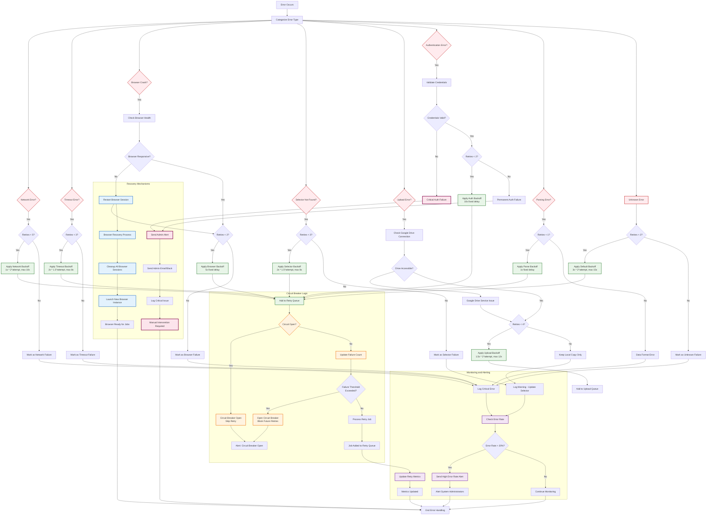

# Error Handling Flow

## Error Handling Strategy

### Error Classification System

#### 1. Network Errors
- **Retry Strategy**: Up to 5 attempts with exponential backoff (1s × 2^attempt, max 10s)
- **Examples**: Connection timeouts, DNS failures, socket errors
- **Recovery**: Automatic retry with network health checks

#### 2. Timeout Errors  
- **Retry Strategy**: Up to 3 attempts with moderate backoff (2s × 1.5^attempt, max 8s)
- **Examples**: Page load timeouts, selector wait timeouts
- **Recovery**: Increase timeout thresholds progressively

#### 3. Browser Crashes
- **Retry Strategy**: Up to 2 attempts with browser restart
- **Examples**: Chrome crashes, page target closed
- **Recovery**: Complete browser session restart

#### 4. Selector Not Found
- **Retry Strategy**: Up to 3 attempts with moderate backoff
- **Examples**: Element not present, invalid CSS selectors
- **Recovery**: Log warning for manual selector review

#### 5. Upload Errors
- **Retry Strategy**: Up to 4 attempts with exponential backoff (1.5s × 2^attempt, max 12s)
- **Examples**: Google Drive API failures, network issues during upload
- **Recovery**: Maintain local copies, retry with connection checks

#### 6. Authentication Errors
- **Retry Strategy**: Up to 2 attempts with credential validation
- **Examples**: Invalid Google API credentials, expired tokens
- **Recovery**: Alert administrators immediately

#### 7. Parsing Errors
- **Retry Strategy**: 1 attempt only (data format issues)
- **Examples**: Invalid CSV format, corrupted data
- **Recovery**: Log error for data source review

### Circuit Breaker Implementation

#### States
- **CLOSED**: Normal operation, requests pass through
- **OPEN**: Failures exceeded threshold, block requests
- **HALF_OPEN**: Test single request to check recovery

#### Thresholds
- **Failure Threshold**: 5 consecutive failures
- **Reset Timeout**: 30 seconds
- **Monitoring Period**: 5 minutes

### Recovery Mechanisms

#### Browser Recovery
1. **Detection**: Monitor for browser crash signals
2. **Cleanup**: Close all existing browser sessions
3. **Restart**: Launch new browser instance with fresh profile
4. **Validation**: Verify browser responsiveness before resuming

#### Service Recovery
1. **Health Checks**: Continuous monitoring of external services
2. **Graceful Degradation**: Disable non-critical features during outages
3. **Auto-Recovery**: Attempt service reconnection with backoff
4. **Manual Escalation**: Alert administrators for persistent issues

### Monitoring and Alerting

#### Error Rate Monitoring
- **Threshold**: Alert when error rate exceeds 20%
- **Window**: 15-minute rolling window
- **Actions**: Notify administrators via email/Slack

#### Critical Error Alerts
- **Authentication Failures**: Immediate admin notification
- **Circuit Breaker Opens**: System degradation alert
- **Browser Recovery**: Service restart notification

#### Metrics Collection
- **Error Types**: Count and categorize all errors
- **Retry Success Rate**: Monitor retry effectiveness
- **Recovery Time**: Track service restoration duration
- **Resource Usage**: Monitor browser session limits