# Master System Overview

```mermaid
graph TB
    subgraph "📊 Data Input Layer"
        CSV[CSV Files<br/>📄 Batch Data]
        GSheets[Google Sheets<br/>🔗 Real-time Data]
        Manual[Manual Input<br/>🖱️ Single Records]
    end
    
    subgraph "🔄 Processing Core"
        DIS[Data Ingestion Service<br/>📋 Parse & Validate]
        PP[Processing Pipeline<br/>🎯 Orchestration Hub]
        QM[Queue Manager<br/>📊 Redis Bull Queues]
        
        subgraph "⚡ Queue Types"
            ScreenQ[(Screenshot Queue<br/>🔥 Priority: NORMAL)]
            RetryQ[(Retry Queue<br/>🔄 Priority: HIGH)]
            UploadQ[(Upload Queue<br/>☁️ Priority: LOW)]
        end
    end
    
    subgraph "🌐 Browser Automation Layer"
        BAE[Browser Automation Engine<br/>🎮 Chrome Control]
        BE[Bookmarklet Executor<br/>📝 JS Injection]
        CEB[Chrome Extension Bridge<br/>🔌 Advanced Features]
        
        subgraph "📱 Device Sessions"
            AndroidSession[Android Session<br/>📱 Galaxy S23]
            iOSSession[iOS Session<br/>📱 iPhone 14 Pro]
            DesktopSession[Desktop Session<br/>🖥️ 1920x1080]
        end
    end
    
    subgraph "📷 Screenshot Processing"
        SM[Screenshot Manager<br/>🎨 Image Processing]
        Sharp[Sharp Library<br/>⚡ Optimization]
        Quality[Quality Control<br/>✅ Validation]
    end
    
    subgraph "💾 Storage Management"
        FSS[File Storage Service<br/>📁 Local Organization]
        US[Upload Service<br/>☁️ Cloud Sync]
        
        subgraph "📂 Storage Hierarchy"
            LocalStorage[Local File System<br/>📁 /screenshots/YYYY/MM/DD/Platform/]
            GDrive[Google Drive<br/>☁️ Organized Folders & Metadata]
        end
    end
    
    subgraph "🔍 Monitoring & Operations"
        LS[Logging Service<br/>📋 Winston Logger]
        EH[Error Handler<br/>🛡️ Retry Logic & Circuit Breakers]
        
        subgraph "📊 Health & Metrics"
            HC[Health Check<br/>❤️ System Status]
            Metrics[Metrics Collector<br/>📈 Performance Data]
            Alerts[Alert System<br/>🚨 Multi-channel Notifications]
        end
    end
    
    subgraph "⏰ Automation & Scheduling"
        Cron[Cron Scheduler<br/>⏰ Automated Processing]
        
        subgraph "🔄 Scheduled Tasks"
            MainTask[Main Processing<br/>*/30 * * * * - Every 30min]
            HealthTask[Health Checks<br/>*/5 * * * * - Every 5min]
            CleanupTask[Cleanup<br/>0 2 * * * - Daily 2AM]
            BackupTask[Backup<br/>0 3 * * 0 - Weekly]
        end
    end
    
    subgraph "🔒 Security & Config"
        Config[Configuration<br/>⚙️ Environment Variables]
        Secrets[Secrets Management<br/>🔐 API Keys & Credentials]
        Auth[Authentication<br/>🔑 Google OAuth2]
    end
    
    subgraph "🌍 External Integrations"
        ChromeBrowser[Chrome Browser<br/>🌐 Headless Automation]
        ChromeExt[Chrome Extension<br/>🔧 Advanced Screenshots]
        RedisServer[(Redis Server<br/>🚀 Queue Persistence)]
        GoogleAPIs[Google APIs<br/>🔗 Drive & Sheets]
    end
    
    %% Main Data Flow
    CSV --> DIS
    GSheets --> DIS  
    Manual --> DIS
    DIS --> PP
    
    PP --> QM
    QM --> ScreenQ
    QM --> RetryQ
    QM --> UploadQ
    
    ScreenQ --> BAE
    BAE --> AndroidSession
    BAE --> iOSSession
    BAE --> DesktopSession
    BAE --> BE
    BAE --> CEB
    
    AndroidSession --> SM
    iOSSession --> SM
    DesktopSession --> SM
    SM --> Sharp
    Sharp --> Quality
    Quality --> FSS
    
    FSS --> LocalStorage
    UploadQ --> US
    US --> GDrive
    
    %% Cross-cutting Concerns
    PP --> LS
    PP --> EH
    EH --> RetryQ
    EH --> Alerts
    
    HC --> PP
    HC --> Metrics
    Metrics --> Alerts
    
    Cron --> MainTask
    Cron --> HealthTask
    Cron --> CleanupTask  
    Cron --> BackupTask
    
    MainTask --> PP
    HealthTask --> HC
    CleanupTask --> LS
    BackupTask --> LocalStorage
    
    %% External Dependencies
    BAE --> ChromeBrowser
    CEB --> ChromeExt
    QM --> RedisServer
    US --> GoogleAPIs
    DIS --> GoogleAPIs
    Auth --> GoogleAPIs
    
    %% Configuration
    Config --> PP
    Secrets --> Auth
    Secrets --> GoogleAPIs
    
    %% Status Reporting
    subgraph "📊 System Outputs"
        Screenshots[Screenshots<br/>🖼️ High-quality Images]
        Reports[Processing Reports<br/>📈 Success/Failure Stats]
        Logs[System Logs<br/>📋 Detailed Activity]
        Notifications[Notifications<br/>🔔 Alerts & Status Updates]
    end
    
    LocalStorage --> Screenshots
    GDrive --> Screenshots
    LS --> Logs
    PP --> Reports
    Alerts --> Notifications
    
    %% Real-time Data Flow Annotations
    DIS -.->|"AdRecord Objects<br/>{URL, PID, UID, AdType, Selector, DeviceUI}"| PP
    ScreenQ -.->|"Processing Jobs<br/>with Retry Logic"| BAE
    SM -.->|"PNG Buffers<br/>Optimized Images"| FSS
    FSS -.->|"File Metadata<br/>Naming Convention"| US
    EH -.->|"Error Classification<br/>Retry Strategies"| RetryQ
    HC -.->|"System Health<br/>Service Status"| Alerts
    
    %% Performance Indicators
    PP -.->|"50+ Records/Batch<br/>95% Success Rate"| QM
    BAE -.->|"3-5 Parallel Sessions<br/>10-15s per Screenshot"| SM
    US -.->|"Organized Folders<br/>Automated Metadata"| GDrive
    Alerts -.->|"Email, Slack, Discord<br/>Multi-channel Delivery"| Notifications
    
    %% Styling
    classDef input fill:#e8f5e8,stroke:#2e7d32,stroke-width:2px
    classDef core fill:#e3f2fd,stroke:#1565c0,stroke-width:2px
    classDef automation fill:#fff3e0,stroke:#f57c00,stroke-width:2px
    classDef processing fill:#f3e5f5,stroke:#6a1b9a,stroke-width:2px
    classDef storage fill:#fce4ec,stroke:#880e4f,stroke-width:2px
    classDef monitoring fill:#e0f2f1,stroke:#00695c,stroke-width:2px
    classDef scheduling fill:#f1f8e9,stroke:#558b2f,stroke-width:2px
    classDef security fill:#fff8e1,stroke:#ff8f00,stroke-width:2px
    classDef external fill:#efebe9,stroke:#5d4037,stroke-width:2px
    classDef output fill:#e8eaf6,stroke:#3f51b5,stroke-width:2px
    classDef queue fill:#fdf2f8,stroke:#ec4899,stroke-width:2px
    
    class CSV,GSheets,Manual input
    class DIS,PP,QM core
    class BAE,BE,CEB,AndroidSession,iOSSession,DesktopSession automation
    class SM,Sharp,Quality processing
    class FSS,US,LocalStorage,GDrive storage
    class LS,EH,HC,Metrics,Alerts monitoring
    class Cron,MainTask,HealthTask,CleanupTask,BackupTask scheduling
    class Config,Secrets,Auth security
    class ChromeBrowser,ChromeExt,RedisServer,GoogleAPIs external
    class Screenshots,Reports,Logs,Notifications output
    class ScreenQ,RetryQ,UploadQ queue
```

## System Overview Summary

### 🎯 Core Mission
The **Multi-platform Ad Query & Screenshot Automation System** is designed to capture high-quality screenshots of web advertisements across multiple device platforms (Android, iOS, Desktop) with full automation, intelligent error handling, and cloud integration.

### 📊 Key Metrics
- **Processing Capacity**: 50+ records per batch
- **Success Rate**: 95%+ with intelligent retry mechanisms  
- **Concurrency**: 3-5 parallel browser sessions
- **Processing Time**: 10-15 seconds average per screenshot
- **Device Support**: Mobile (Android/iOS) and Desktop platforms
- **Storage**: Local organization + automated Google Drive sync

### 🔄 Processing Workflow
1. **Data Ingestion**: Parse CSV/Google Sheets → Validate records → Create processing jobs
2. **Queue Management**: Distribute jobs across priority queues (Screenshot/Retry/Upload)
3. **Browser Automation**: Launch device-specific Chrome sessions → Navigate URLs → Execute bookmarklets
4. **Screenshot Capture**: Wait for selectors → Capture screenshots → Process with Sharp optimization
5. **Storage Management**: Save locally with organized naming → Upload to Google Drive with metadata
6. **Monitoring**: Log all activities → Generate reports → Send alerts for failures

### 🛡️ Reliability Features
- **Error Handling**: 7 error types with tailored retry strategies and exponential backoff
- **Circuit Breakers**: Prevent cascade failures during service outages
- **Browser Recovery**: Automatic browser restart and session cleanup
- **Queue Persistence**: Redis-backed job storage survives system restarts
- **Health Monitoring**: Continuous service monitoring with multi-channel alerting

### ⚡ Performance Optimizations
- **Parallel Processing**: Multiple browser sessions for concurrent screenshot capture
- **Image Optimization**: Sharp library for high-quality, size-optimized PNG output
- **Smart Queuing**: Priority-based job distribution with retry separation
- **Resource Management**: Automatic cleanup and memory management
- **Caching**: Efficient browser session reuse and resource pooling

### 🔒 Enterprise Features
- **Security**: Google OAuth2 authentication with service account credentials
- **Monitoring**: Comprehensive health checks, metrics collection, and alerting
- **Automation**: Cron-based scheduling with flexible processing intervals  
- **Backup**: Automated data backup and disaster recovery procedures
- **Scalability**: Horizontal scaling through PM2 clustering and queue partitioning

### 🌐 Integration Capabilities
- **Data Sources**: CSV files and Google Sheets API integration
- **Cloud Storage**: Automated Google Drive organization with folder structures
- **Browser Extensions**: Advanced screenshot features through Chrome Extension
- **Bookmarklets**: Dynamic JavaScript injection for interactive content
- **APIs**: RESTful health check and status endpoints for external monitoring

### 📈 Operational Excellence
- **Development**: TypeScript with strict typing and comprehensive testing
- **Deployment**: Production-ready with PM2 process management and Docker support
- **Monitoring**: Winston logging with structured output and log rotation
- **Documentation**: Complete API documentation and deployment guides
- **Maintenance**: Automated cleanup, backup, and system health procedures

This system represents a production-grade solution for automated web advertisement screenshot capture with enterprise-level reliability, monitoring, and integration capabilities.