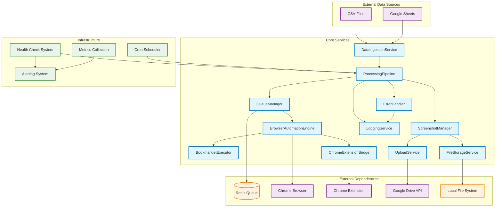

# System Architecture Diagram

## Service Responsibilities

### Core Services
- **ProcessingPipeline**: Orchestrates the entire workflow and manages service coordination
- **DataIngestionService**: Parses CSV files and Google Sheets data into AdRecord objects
- **QueueManager**: Manages job queues using Redis Bull queues with retry logic
- **BrowserAutomationEngine**: Controls Chrome browser instances with mobile emulation
- **BookmarkletExecutor**: Executes JavaScript bookmarklets in browser contexts
- **ChromeExtensionBridge**: Communicates with Chrome Extension for advanced screenshots
- **ScreenshotManager**: Processes screenshots with Sharp image manipulation
- **FileStorageService**: Manages local file storage with organized folder structures
- **UploadService**: Handles Google Drive uploads with folder organization
- **LoggingService**: Provides structured logging with Winston
- **ErrorHandler**: Implements retry strategies, circuit breakers, and error categorization

### External Dependencies
- **Redis**: Queue management and job persistence
- **Chrome Browser**: Web page rendering and screenshot capture
- **Chrome Extension**: Advanced screenshot capabilities and element highlighting
- **Google Drive API**: Cloud storage for screenshots with automated folder organization
- **Local File System**: Temporary storage and backup location

### Infrastructure Components
- **Cron Scheduler**: Automated batch processing triggers
- **Health Check System**: Service monitoring and status reporting
- **Alerting System**: Multi-channel notifications (Email, Slack, Discord)
- **Metrics Collection**: Performance monitoring and analytics